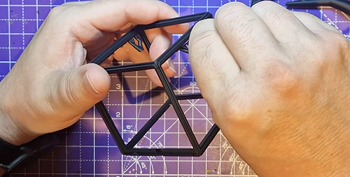
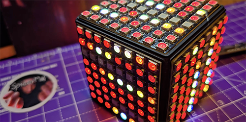

# ledMatrixCubeFrame
STL of frame for mounting 64 led matrix into a cube

From SpiderMaf video here:
https://www.youtube.com/watch?v=cWp9GtUtEwg

Also in repo is the original frame for sizing - and the openscad files if you need to tweak the sizes.
